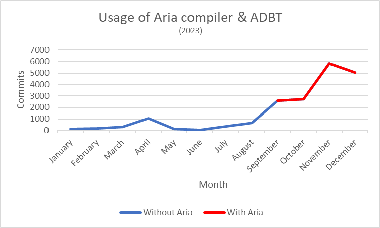

<h2 align="center">
 <pre>
    ___        __   _    __        _      __
   /   |  ____/ /  | |  / /____   (_)____/ /
  / /| | / __  /   | | / // __ \ / // __  / 
 / ___ |/ /_/ /    | |/ // /_/ // // /_/ /  
/_/  |_|\__,_/     |___/ \____//_/ \__,_/   
                                            
 </pre>                                     
</h2>

 

✈ An efficient AdBlock filter list that blocks ads, trackers, malware, phishing attempts, fake download links, fake search results, and a lot more if you want it to! Things like: cookie-consent banners, popups, modals, push notifications, survey, newsletter and subscribe popups, rating dialogs, sharing, Google Chromecast, popup chats, post widgets, like widgets, comments, service workers, news widgets, JavaScript and CSS maps, PWA install banners, Webmanifests, SWF objects, website reporters, skips countdowns, etc. 👾

 
 

<blockquote align="center">If you are new to ad-blocking, make sure to read the <a href="https://github.com/igorskyflyer/ad-void/blob/main/QUICKSTART.md" target="_blank">QUICKSTART</a> first. 😉</blockquote>

 
 

  
  
  
  
	 
  
  
  
  
	 
  
  
  

 

	<blockquote>
		<h4>💖 Support further development</h4>
		I work hard for every project, including this one and your support means a lot to me!
		 
		Consider buying me a coffee. ☕
		 
		<strong>Thank you for supporting my efforts! 🙏😊</strong>
		 
		 
		
		 
		 
		<a href="https://github.com/igorskyflyer"><em>Igor Dimitrijević (@igorskyflyer)</em></a>
	</blockquote>

 
 

<blockquote align="center">
	💕<em>Since Dec 19 2022, this project is supported by the <a href="https://adguard.com" target="_blank">AdGuard</a> (*) team.</em> 🥳
	 
	* support via a free developer license being given
</blockquote>

 
 

👽 Since _Aug 14 2023_, this project has been powered by [`ADBT`](https://github.com/igorskyflyer/file-format-adbt) - a language that defines template files and provides ways of writing reusable, component-like based Adblock filter files and its compiler [`Aria`](https://github.com/igorskyflyer/npm-adblock-aria-compiler) that substantially increase productivity and cut off the time needed for maintaining these filter lists, which means more frequent updates and delivery on a daily basis.  

Read more about this in the [Genesis](#-genesis) section of this page.

 
 

<h3>🚨 IMPORTANT</h3>

<blockquote>
As <code>AdVoid</code> continues to improve, certain rules will get deprecated and removed from main filter lists and be transferred to the <em>Legacy</em> filter lists, see <a href="https://github.com/igorskyflyer/ad-void/tree/main/legacy">Legacy README</a> for more information.
</blockquote>

 
 
 

## 🤹🏼‍♂️ Usage

Install it into your ad-blocker by clicking on following subscribe button  or by manually adding a filter list with the URL of:  

 <code>https://raw.githubusercontent.com/igorskyflyer/ad-void/main/AdVoid.Core.txt</code>

 

If you are using a system-wide ad-blocker it is also beneficial to add this filter list by clicking on the following button  or by manually adding a filter list with the URL of:  

 <code>https://raw.githubusercontent.com/igorskyflyer/ad-void/main/AdVoid.DNS.txt</code>

_This filter list will block network requests at a lower (DNS) level, which improves page load and/or performance of Web pages._

---

For additional privacy, faster browsing experience and less tracking these AdVoid add-ons are available as well:
 

😒 &nbsp; [AdVoid.Addon.NoAnnoyances](https://github.com/igorskyflyer/ad-void/blob/main/add-ons/AdVoid.Addon.NoAnnoyances.txt) &nbsp; 
 
 
<em>Blocks site annoyances like cookie-consent banners, popups, modals, push notifications, survey, newsletter and subscribe popups, rating dialogs, skips countdowns, etc.</em>
 
 

💬 &nbsp; [AdVoid.Addon.NoExternals](https://github.com/igorskyflyer/ad-void/blob/main/add-ons/AdVoid.Addon.NoExternals.txt) &nbsp; 
 
 
<em>Blocks external features, like sharing, Google Chromecast, popup chats, post widgets, like widgets, comments, etc.</em>
 
 

🦄 &nbsp; [AdVoid.Addon.NoExtras](https://github.com/igorskyflyer/ad-void/blob/main/add-ons/AdVoid.Addon.NoExtras.txt) &nbsp; 
 
 
<em>Blocks non-essential resources like service workers, news widgets, JavaScript and CSS maps, PWA install banners, Webmanifests, SWF objects, etc.</em>
 
 

🧪 &nbsp; [AdVoid.Addon.Experiments](https://github.com/igorskyflyer/ad-void/blob/main/add-ons/AdVoid.Addon.Experiments.txt) &nbsp; 
 
 
<em>Unstable and experimental filter list, use only for testing purposes and with caution since it may break certain sites.</em>
 
 

---

### 🫱🏽‍🫲🏼 Zero hassle

If you don't want to bother adding multiple filter lists, you can get all of them bundled into one filter list - all except `AdVoid.Addon.Experiments` and scriptlets.

You can add the bundled filter list by clicking here 👉🏼  or by manually adding a filter list with the URL of:  

 <code>https://raw.githubusercontent.com/igorskyflyer/ad-void/main/AdVoid.Full.txt</code>

---

## 🧬 Genesis
### 📚 Case study

AdVoid was started as a personal project in January, 2022 then made public mid February of the same year. At first it was very easy to add new rules or modify existing ones since there were only a few rules to manage. As the filter list continued to grow, it diverged into distinct, smaller lists known as **add-ons** and **modules** - for easier maintenance.

 

#### 🐛 Divergence pt. 1

The modules are:
- [AdVoid.Core](https://github.com/igorskyflyer/ad-void/blob/main/AdVoid.Core.txt) - core functionality = ad-blocking (URL + cosmetic)
- [AdVoid.DNS](https://github.com/igorskyflyer/ad-void/blob/main/AdVoid.DNS.txt) - DNS-blocking (URL only)
- [AdVoid.Full](https://github.com/igorskyflyer/ad-void/blob/main/AdVoid.Full.txt) - full content blocking (core functionality + add-ons)

 

#### 🐛 Divergence pt. 2

The add-ons are:
- [AdVoid.Addon.NoAnnoyances](https://github.com/igorskyflyer/ad-void/blob/main/add-ons/AdVoid.Addon.NoAnnoyances.txt) - blocks site annoyances like cookie-consent banners, popups, etc.
- [AdVoid.Addon.NoExternals](https://github.com/igorskyflyer/ad-void/blob/main/add-ons/AdVoid.Addon.NoExternals.txt) - blocks external features, like sharing, Google Chromecast, etc.
- [AdVoid.Addon.NoExtras](https://github.com/igorskyflyer/ad-void/blob/main/add-ons/AdVoid.Addon.NoExtras.txt) - blocks non-essential resources like news widgets, JavaScript and CSS maps, PWA install banners, etc.
- [AdVoid.Addon.Experiments](https://github.com/igorskyflyer/ad-void/blob/main/add-ons/AdVoid.Addon.Experiments.txt) - unstable and experimental filter list, use only for testing purposes and with caution since it may break certain sites.

---

Even so it was a hassle to maintain the filter lists, in particular it involved hours of endless scrolling through rules to add a new rule to the end of a particular section or deleting one, updating the timestamp to the current one following the ISO 8601 standard using non-maintainer's timezone, bumping the version, changing the description and many things more.

> That's where [**ADBT**](https://github.com/igorskyflyer/file-format-adbt) - a language that defines template files and provides ways of writing reusable, component-like based Adblock filter files and its compiler [`Aria`](https://github.com/igorskyflyer/npm-adblock-aria-compiler) come into play.

 

After creating the before-mentioned solutions, [AdVoid](https://github.com/igorskyflyer/ad-void) was split even further into small chunks of rules, properly organized which allowed for easier maintenance, less time scrolling through endless lists of rules and more importantly it allowed re-use of rules, i.e. rules that were repeating, e.g. URLs that are blocked in all 3 modules: [AdVoid.Core](https://github.com/igorskyflyer/ad-void/blob/main/AdVoid.Core.txt), [AdVoid.DNS](https://github.com/igorskyflyer/ad-void/blob/main/AdVoid.DNS.txt), [AdVoid.Full](https://github.com/igorskyflyer/ad-void/blob/main/AdVoid.Full.txt) are contained in a single file and [`Aria`](https://github.com/igorskyflyer/npm-adblock-aria-compiler) fetches the URLs from the given file and applies transformations when needed, e.g. domain rules are stripped of all modifiers for the [AdVoid.DNS](https://github.com/igorskyflyer/ad-void/blob/main/AdVoid.DNS.txt) module.

 

Since [`Aria`](https://github.com/igorskyflyer/npm-adblock-aria-compiler) saves a substantial amount of time needed for maintaining filter lists, it \[ *Aria* \] has allowed the productivity to increase exponentially which in turn allowed for rule additions to skyrocket, see the graph below. 🚀

 

	<figure>
		
		<figcaption>Figure 1: a graph showing substantial increase of rule additions when using the <a href="https://github.com/igorskyflyer/npm-adblock-aria-compiler"><code>Aria</code></a> compiler</figcaption>
	</figure>

 
 

> Let's crunch those numbers! 🍪

 

Prior to implementing `ADBT` template files and using the [`Aria`](https://github.com/igorskyflyer/npm-adblock-aria-compiler) compiler, which occurred in mid August, 2023, there were ~**236** rule additions per month.  

After implementing the before-mentioned solutions there were ~**3024** rule additions per month (+**1181.4%**), while additions reached their peak in November, with staggering ~**5816** rule additions (+**2364.4%**) respectively, in November.

---

 

<h3 align="center">🕺🏻 HAPPY BLOCKING! 🥳</h3>
