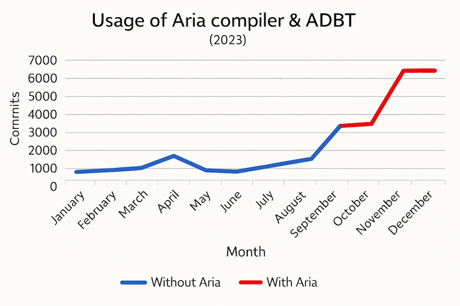

<!-- GitAds-Verify: OW4DALUZOPA9QFX7GNTQ4F7KNT98R3AK -->

<div align="center">
  
  <h1>AdVoid</h1>
</div>

<blockquote align="center">Super-Fast Updates • More Complete Blocking • Always-Fresh Protection • Trusted by Thousands Daily</blockquote>

<h4 align="center">
  🛡️ A set of modular, highly-optimized, and efficient filter lists that block ads, trackers, malware, phishing, and intrusive web clutter - from cookie banners to fake links. 👾
</h4>

<br>

<div align="center">
  <a href="https://www.jsdelivr.com/package/gh/the-advoid/ad-void"></a>
  <a href="https://github.com/the-advoid/ad-void/tree/main/AdVoid.Core.txt"></a>
  <a href="https://github.com/the-advoid/ad-void/tree/main/AdVoid.Core.txt"></a>
  <br>
  <a href="https://github.com/the-advoid/ad-void/pulls?q=is%3Apr+is%3Aclosed"></a>
  <a href="https://github.com/the-advoid/ad-void/commits/"></a>
  <a href="https://github.com/the-advoid/ad-void/issues?q=is%3Aissue+is%3Aclosed"></a>
  <br>
  <a href="https://www.jsdelivr.com/package/gh/the-advoid/ad-void"></a>
  <a href="https://github.com/the-advoid/ad-void/commits/"></a>
  <a href="https://github.com/the-advoid/ad-void/tree/main/LICENSE"></a>
</a>
</div>

<br>

<blockquote align="center">
  Supported by <a href="https://adguard.com?aid=135952"><strong>AdGuard</strong></a> since December 19, 2022 and GitAds.
  <br>
  <br>
  <a href="https://gitads.dev/v1/ad-track?source=the-advoid/ad-void@github"></a>
</blockquote>

<br>
<br>

## 📃 Table of Contents

- [**Quickstart**](#ℹ️-quickstart)
- [**Features**](#-features)
- [**Usage**](#-usage)
  - [**Modules**](#-modules)
    - [**Full**](#️-advoidfull)
    - [**Core**](#-advoidcore)
    - [**Lite**](#-advoidlite)
    - [**DNS**](#-advoiddns)
  - [**Add-ons**](#-add-ons)
    - [**NoAnnoyances**](#-advoidaddonnoannoyances)
    - [**NoExternals**](#-advoidaddonnoexternals)
    - [**NoExtras**](#-advoidaddonnoextras)
    - [**Experiments**](#-advoidaddonexperiments)
  - [**Scriptlets**](#-scriptlets)
    - [**AntiAntiAdBlock**](#-advoidscriptletsantiantiadblock)
- [**Filter Trust**](#️-filter-trust)
- [**Legacy**](#-legacy)
- [**Case Study**](#-case-study)
  - [**Divergence Pt. 1**](#-divergence-pt-1)
  - [**Divergence Pt. 2**](#-divergence-pt-2)
- [**Productivity Gains**](#-productivity-gains)
- [**Disclaimer**](#️-disclaimer)
- [**Contributing**](#-contributing)
- [**Contributors**](#%E2%80%8D-contributors)
- [**Support**](#-support)
- [**License**](#-license)
- [**Related**](#-related)
- [**Author**](#-author)

<br>
<br>

## 🤖 Features

- 🚫 Blocks ads, trackers, malware and phishing
- 🍪 Removes cookie banners and consent pop-ups
- 📦 Eliminates fake download links and search results
- 📣 Silences push notifications and intrusive modals
- 📰 Hides news widgets, post widgets and comments
- 🎯 Skips countdowns and bypasses delays
- 📺 Disables Chromecast prompts and popup chats
- 🛠 Stops service workers, PWA banners and webmanifests
- 🗺 Strips JavaScript and CSS maps
- 🕹 Removes SWF objects and site reporters

<br>

## ℹ️ Quickstart

🆕 New to ad-blocking? Read the <a href="https://github.com/the-advoid/ad-void/blob/main/QUICKSTART.md" target="_blank"><strong>QUICKSTART</strong></a> first. 😉

<br>

## 🕵🏼 Usage

Get all `AdVoid` filter lists in one bundle as `AdVoid.Full` or choose only modules that you need.

<br>

> 🛡️ Note that some `AdVoid` rules require ***trust*** to activate.
>
> See [**Filter Trust**](#️-filter-trust) for more details - benefits and dangers that it brings.

<br>

### 🐦‍🔥 Modules

Modules are the four core `AdVoid` filter lists. Designed for layered protection: block ads, trackers, malware, and annoyances across web, DNS, and browser surfaces.

---

#### 🛡️ AdVoid.Full

##### The Complete Protection

> Includes all modules and add-ons, except experimental rules and standalone scriptlets. Blocks major ad-servers, trackers, malware, fake download links, cookie-consent banners, pop-ups, modals, push notifications, survey, newsletter and subscribe pop-ups, sharing, Google Chromecast, popup chats, post widgets, like widgets, news widgets, JavaScript and CSS maps, PWA install banners, SWF objects.
>
> ✨ If you subscribe to this filter list, you do **not** need any of the other filter lists below it.
>

<br>

Subscribe via `GitHub` to get `instant` updates, either by clicking the `Subscribe` button below or copying the URL below and pasting it into your ad-blocker.

<a href="https://subscribe.adblockplus.org/?location=https://raw.githubusercontent.com/the-advoid/ad-void/main/AdVoid.Full.txt&title=AdVoid.Full"></a>

```
https://raw.githubusercontent.com/the-advoid/ad-void/main/AdVoid.Full.txt
```

<br>

Subscribe via the *fallback CDN* `jsDelivr` to get `delayed` updates (up to 12h), either by clicking the `Subscribe` button below or copying the URL below and pasting it into your ad-blocker.

<a href="https://subscribe.adblockplus.org/?location=https://cdn.jsdelivr.net/gh/the-advoid/ad-void@main/AdVoid.Full.txt&title=AdVoid.Full"></a>

```
https://cdn.jsdelivr.net/gh/the-advoid/ad-void@main/AdVoid.Full.txt
```

---

#### 📦 AdVoid.Core

##### The Core Protection Module

> Blocks major ad-servers, trackers, malware, fake download links, cuts-down timer executions.

<br>

Subscribe via `GitHub` to get `instant` updates, either by clicking the `Subscribe` button below or copying the URL below and pasting it into your ad-blocker.

<a href="https://subscribe.adblockplus.org/?location=https://raw.githubusercontent.com/the-advoid/ad-void/main/AdVoid.Core.txt&title=AdVoid.Core"></a>

```
https://raw.githubusercontent.com/the-advoid/ad-void/main/AdVoid.Core.txt
```

<br>

Subscribe via the *fallback CDN* `jsDelivr` to get `delayed` updates (up to 12h), either by clicking the `Subscribe` button below or copying the URL below and pasting it into your ad-blocker.

<a href="https://subscribe.adblockplus.org/?location=https://cdn.jsdelivr.net/gh/the-advoid/ad-void@main/AdVoid.Core.txt&title=AdVoid.Core"></a>

```
https://cdn.jsdelivr.net/gh/the-advoid/ad-void@main/AdVoid.Core.txt
```

---

#### 🌱 AdVoid.Lite

##### The Lite Protection Module

> Blocks the most common ad servers, trackers, and malware - delivering fast, minimal protection with low overhead. Perfect for mobile, low-power devices, or users who want a simple baseline shield. Refrains from using advanced and CPU-heavy rules.
>
> Lighter by ~35% than [**AdVoid.Full**](#️-advoidfull) and by ~12% than [**AdVoid.Core**](#-advoidcore).

<br>

Subscribe via `GitHub` to get `instant` updates, either by clicking the `Subscribe` button below or copying the URL below and pasting it into your ad-blocker.

<a href="https://subscribe.adblockplus.org/?location=https://raw.githubusercontent.com/the-advoid/ad-void/main/AdVoid.Lite.txt&title=AdVoid.Lite"></a>

```
https://raw.githubusercontent.com/the-advoid/ad-void/main/AdVoid.Lite.txt
```

<br>

Subscribe via the *fallback CDN* `jsDelivr` to get `delayed` updates (up to 12h), either by clicking the `Subscribe` button below or copying the URL below and pasting it into your ad-blocker.

<a href="https://subscribe.adblockplus.org/?location=https://cdn.jsdelivr.net/gh/the-advoid/ad-void@main/AdVoid.Lite.txt&title=AdVoid.Lite"></a>

```
https://cdn.jsdelivr.net/gh/the-advoid/ad-void@main/AdVoid.Lite.txt
```

---

#### 🌐 AdVoid.DNS

##### The DNS-level Module

> Blocks domains before requests reach your browser: ads, trackers, telemetry, malware, and known nuisances. Lightweight, system-wide protection.
> Suitable for system-wide ad-blockers.

<br>

Subscribe via `GitHub` to get `instant` updates, either by clicking the `Subscribe` button below or copying the URL below and pasting it into your ad-blocker.

<a href="https://subscribe.adblockplus.org/?location=https://raw.githubusercontent.com/the-advoid/ad-void/main/AdVoid.DNS.txt&title=AdVoid.DNS"></a>

```
https://raw.githubusercontent.com/the-advoid/ad-void/main/AdVoid.DNS.txt
```

<br>

Subscribe via the *fallback CDN* `jsDelivr` to get `delayed` updates (up to 12h), either by clicking the `Subscribe` button below or copying the URL below and pasting it into your ad-blocker.

<a href="https://subscribe.adblockplus.org/?location=https://cdn.jsdelivr.net/gh/the-advoid/ad-void@main/AdVoid.DNS.txt&title=AdVoid.DNS"></a>

```
https://cdn.jsdelivr.net/gh/the-advoid/ad-void@main/AdVoid.DNS.txt
```

---

<br>

### 🪼 Add-ons

For additional privacy, faster browsing experience and less tracking these `AdVoid` add-ons are available.

---

#### 😒 AdVoid.Addon.NoAnnoyances

##### The No Annoyances Add-on

> Blocks site annoyances: cookie-consent banners, pop-ups, modals, push notifications, survey, newsletter and subscribe pop-ups, rating dialogs, skips countdowns, etc.

<br>

Subscribe via `GitHub` to get `instant` updates, either by clicking the `Subscribe` button below or copying the URL below and pasting it into your ad-blocker.

<a href="https://subscribe.adblockplus.org/?location=https://raw.githubusercontent.com/the-advoid/ad-void/main/add-ons/AdVoid.Addon.NoAnnoyances.txt&title=AdVoid.Addon.NoAnnoyances"></a>

```
https://raw.githubusercontent.com/the-advoid/ad-void/main/add-ons/AdVoid.Addon.NoAnnoyances.txt
```

<br>

Subscribe via the *fallback CDN* `jsDelivr` to get `delayed` updates (up to 12h), either by clicking the `Subscribe` button below or copying the URL below and pasting it into your ad-blocker.

<a href="https://subscribe.adblockplus.org/?location=https://cdn.jsdelivr.net/gh/the-advoid/ad-void@main/add-ons/AdVoid.Addon.NoAnnoyances.txt&title=AdVoid.Addon.NoAnnoyances"></a>

```
https://cdn.jsdelivr.net/gh/the-advoid/ad-void@main/add-ons/AdVoid.Addon.NoAnnoyances.txt
```

---

#### 💬 AdVoid.Addon.NoExternals

##### The No Externals Add-on

> Blocks external features: sharing, Google Chromecast, popup chats, post widgets, like widgets, etc.

<br>

Subscribe via `GitHub` to get `instant` updates, either by clicking the `Subscribe` button below or copying the URL below and pasting it into your ad-blocker.

<a href="https://subscribe.adblockplus.org/?location=https://raw.githubusercontent.com/the-advoid/ad-void/main/add-ons/AdVoid.Addon.NoExternals.txt&title=AdVoid.Addon.NoExternals"></a>

```
https://raw.githubusercontent.com/the-advoid/ad-void/main/add-ons/AdVoid.Addon.NoExternals.txt
```

<br>

Subscribe via the *fallback CDN* `jsDelivr` to get `delayed` updates (up to 12h), either by clicking the `Subscribe` button below or copying the URL below and pasting it into your ad-blocker.

<a href="https://subscribe.adblockplus.org/?location=https://cdn.jsdelivr.net/gh/the-advoid/ad-void@main/add-ons/AdVoid.Addon.NoExternals.txt&title=AdVoid.Addon.NoExternals"></a>

```
https://cdn.jsdelivr.net/gh/the-advoid/ad-void@main/add-ons/AdVoid.Addon.NoExternals.txt
```

---

#### 🦄 AdVoid.Addon.NoExtras

##### The No Extras Add-on

> Blocks non-essential resources: news widgets, JavaScript and CSS maps, PWA install banners, SWF objects, etc.

<br>

Subscribe via `GitHub` to get `instant` updates, either by clicking the `Subscribe` button below or copying the URL below and pasting it into your ad-blocker.

<a href="https://subscribe.adblockplus.org/?location=https://raw.githubusercontent.com/the-advoid/ad-void/main/add-ons/AdVoid.Addon.NoExtras.txt&title=AdVoid.Addon.NoExtras"></a>

```
https://raw.githubusercontent.com/the-advoid/ad-void/main/add-ons/AdVoid.Addon.NoExtras.txt
```

<br>

Subscribe via the *fallback CDN* `jsDelivr` to get `delayed` updates (up to 12h), either by clicking the `Subscribe` button below or copying the URL below and pasting it into your ad-blocker.

<a href="https://subscribe.adblockplus.org/?location=https://cdn.jsdelivr.net/gh/the-advoid/ad-void@main/add-ons/AdVoid.Addon.NoExtras.txt&title=AdVoid.Addon.NoExtras"></a>

```
https://cdn.jsdelivr.net/gh/the-advoid/ad-void@main/add-ons/AdVoid.Addon.NoExtras.txt
```

---

#### 🧪 AdVoid.Addon.Experiments

##### The Experimental Add-on

> **Unstable** and *experimental* filter list, for testing purposes only.  

> ‼️ **It may break certain sites.**

<br>

Subscribe via `GitHub` to get `instant` updates, either by clicking the `Subscribe` button below or copying the URL below and pasting it into your ad-blocker.

<a href="https://subscribe.adblockplus.org/?location=https://raw.githubusercontent.com/the-advoid/ad-void/main/add-ons/AdVoid.Addon.Experiments.txt&title=AdVoid.Addon.Experiments"></a>

```
https://raw.githubusercontent.com/the-advoid/ad-void/main/add-ons/AdVoid.Addon.Experiments.txt
```

<br>

Subscribe via the *fallback CDN* `jsDelivr` to get `delayed` updates (up to 12h), either by clicking the `Subscribe` button below or copying the URL below and pasting it into your ad-blocker.

<a href="https://subscribe.adblockplus.org/?location=https://cdn.jsdelivr.net/gh/the-advoid/ad-void@main/add-ons/AdVoid.Addon.Experiments.txt&title=AdVoid.Addon.Experiments"></a>

```
https://cdn.jsdelivr.net/gh/the-advoid/ad-void@main/add-ons/AdVoid.Addon.Experiments.txt
```

---

<br>

### ⚡ Scriptlets

> #### 🛑 DANGER
>
> If you are not aware what scriptlets are beforehand, it's recommended **not** to use them.
>

Many times, basic ad-blocking is not enough and that's where scriptlets come in. Scriptlets are a superpower inside ad-blocking world. But… *`with great power, comes great responsibility`*!  
Scriptlets are chunks of `JavaScript` code that run on a particular site and can change its behavior majorly, e.g.: cut down waiting time, disable popup windows, prevent aggressive ads and many things more!  

>
> 💡 Remember to add scriptlets ***only*** from trusted source.  
>

`AdVoid` being a complete ad-blocking solution, also provides scriptlets listed below.

---

#### 🥷🏼 AdVoid.Scriptlets.AntiAntiAdBlock

##### Anti-adblock Scriptlet

> Infiltrates and then destroys common anti-adblock techniques.
>
> ‼️ **It may break certain sites.**

<br>

Subscribe via `GitHub` to get `instant` updates, either by clicking the `Subscribe` button below or copying the URL below and pasting it into your ad-blocker.

<a href="https://subscribe.adblockplus.org/?location=https://raw.githubusercontent.com/the-advoid/ad-void/main/scriptlets/AdVoid.Scriptlets.AntiAntiAdBlock.txt&title=AdVoid.Scriptlets.AntiAntiAdBlock"></a>

```
https://raw.githubusercontent.com/the-advoid/ad-void/main/scriptlets/AdVoid.Scriptlets.AntiAntiAdBlock.txt
```

<br>

Subscribe via the *fallback CDN* `jsDelivr` to get `delayed` updates (up to 12h), either by clicking the `Subscribe` button below or copying the URL below and pasting it into your ad-blocker.

<a href="https://subscribe.adblockplus.org/?location=https://cdn.jsdelivr.net/gh/the-advoid/ad-void@main/scriptlets/AdVoid.Scriptlets.AntiAntiAdBlock.txt&title=AdVoid.Scriptlets.AntiAntiAdBlock"></a>

```
https://cdn.jsdelivr.net/gh/the-advoid/ad-void@main/scriptlets/AdVoid.Scriptlets.AntiAntiAdBlock.txt
```

---

<br>

## 🛡️ Filter Trust

While the majority of `AdVoid`'s rules manage to block more than *enough* ads for *most* users, some rules in `AdVoid` only activate if the ad-blocker marks the used list(s) as ***trusted***.  

This will unlock advanced techniques like:
- Setting cookies via scriptlets (`trusted-set-cookie`)
- Rewriting JavaScript on the fly (`replace=...`)
- Redirecting scripts with custom logic (`redirect-rule=...`)

<br>

These are powerful tools that go beyond cosmetic hiding and ad-blocking, they alter a site's behavior directly. To enable them, users must manually mark `AdVoid` filter list(s) as ***trusted*** in their ad-blocker settings.  

Many ad-blockers show an error when trusted rules are encountered (shown below), thus, signaling the list needs to be ***trusted*** to achieve its full potential.

<br>

<blockquote align="center">
  See the <a href="#️-disclaimer"><strong>Disclaimer</strong></a> as well.
</blockquote>

<br>

<div align="center">
  <figure>
    
    <br>
    <figcaption>
      <em><strong>Figure 1.</strong> Errors caused by untrusted rules in uBlock Origin
      <br>
      <code>AdVoid</code>'s advanced rules blocked until the list is marked as trusted</em>
    </figcaption>
  </figure>
</div>

<br>
<br>

## 🎠 Legacy

As `AdVoid` continues to improve, certain rules will get deprecated and removed from main filter lists and transferred to the *Legacy* filter lists, see [**Legacy README**](https://github.com/the-advoid/ad-void/tree/main/legacy) for more information.

<br>

## 📚 Case Study

`AdVoid` was started as a personal project in `January, 2022` then made public mid February of the same year. At first it was very easy to add new rules or modify existing ones since there were only a few rules to manage. As the filter list continued to grow, it diverged into distinct, smaller lists known as **modules** and **add-ons** - for easier maintenance.  

Even with all the rules-splitting, maintenance was cumbersome. Since `Aug 14 2023`, `AdVoid` has been powered by [**ADBT**](https://github.com/adbt-lang/adbt) - a language that defines template files and provides ways of writing reusable, component-like ad-block filter files and its compiler `Aria` that substantially increase productivity and cut down the time needed for maintaining these filter lists, which means more frequent updates and delivery on a daily basis.

<br>

#### 🐛 Divergence Pt. 1

The modules were:
- [**AdVoid.Core**](https://github.com/the-advoid/ad-void/blob/main/AdVoid.Core.txt) - core functionality (ad-blocking, URL + cosmetic)
- [**AdVoid.DNS**](https://github.com/the-advoid/ad-void/blob/main/AdVoid.DNS.txt) - DNS-blocking (URL only)
- [**AdVoid.Full**](https://github.com/the-advoid/ad-void/blob/main/AdVoid.Full.txt) - full content blocking (core functionality + add-ons)

<br>

#### 🐛 Divergence Pt. 2

The add-ons were:
- [**AdVoid.Addon.NoAnnoyances**](https://github.com/the-advoid/ad-void/blob/main/add-ons/AdVoid.Addon.NoAnnoyances.txt) - blocks site annoyances: cookie-consent banners, pop-ups, etc.
- [**AdVoid.Addon.NoExternals**](https://github.com/the-advoid/ad-void/blob/main/add-ons/AdVoid.Addon.NoExternals.txt) - blocks external features: sharing, Google Chromecast, etc.
- [**AdVoid.Addon.NoExtras**](https://github.com/the-advoid/ad-void/blob/main/add-ons/AdVoid.Addon.NoExtras.txt) - blocks non-essential resources: news widgets, JavaScript and CSS maps, PWA install banners, etc.
- [**AdVoid.Addon.Experiments**](https://github.com/the-advoid/ad-void/blob/main/add-ons/AdVoid.Addon.Experiments.txt) - unstable and experimental filter list, use only for testing purposes and with caution since it may break certain sites.

---

Even so it was a hassle to maintain the filter lists, in particular it involved hours of endless scrolling through rules to add a new rule to the end of a particular section or deleting one, updating the timestamp to the current one following the ISO 8601 standard often using non-maintainer's timezone, bumping the version, changing the description and many things more.

> That's where [**ADBT**](https://github.com/adbt-lang/adbt) - a language that defines template files and provides ways of writing reusable, component-like ad-block filter files and its compiler [`Aria`](https://github.com/aria-toolkit/aria-cli) came into play.

After creating the before-mentioned solutions, [**AdVoid**](https://github.com/the-advoid/ad-void) was split even further into small chunks of rules, properly separated and organized which allowed for easier maintenance, less time scrolling through endless lists of rules and more importantly it allowed re-use of rules, i.e. rules that were repeating, e.g. URLs that were blocked in all 3 modules: [**AdVoid.Core**](https://github.com/the-advoid/ad-void/blob/main/AdVoid.Core.txt), [**AdVoid.DNS**](https://github.com/the-advoid/ad-void/blob/main/AdVoid.DNS.txt), [**AdVoid.Full**](https://github.com/the-advoid/ad-void/blob/main/AdVoid.Full.txt) were consolidated in a single file and [`Aria`](https://github.com/aria-toolkit/aria-cli) would fetch the URL rules from the given file and apply transformations when needed, e.g. domain rules are stripped of all modifiers for the [**AdVoid.DNS**](https://github.com/the-advoid/ad-void/blob/main/AdVoid.DNS.txt) module.

<br>

### 🚀 Productivity Gains

Since [`Aria`](https://github.com/aria-toolkit/aria-cli) saves a substantial amount of time needed for maintaining filter lists, `Aria` has allowed the productivity to increase exponentially which in turn allowed for rule additions/deletions to skyrocket, see the graph below. 🚀

<br>

<div align="center">
  <figure>
    
    <br>
    <figcaption>
      <em><strong>Figure 2.</strong> a graph showing substantial increase of rule commits (Jan - Dec, 2023) when using the <a href="https://github.com/aria-toolkit/aria-cli"><code>Aria</code></a> compiler</em>
    </figcaption>
  </figure>
</div>

<br>
<br>

<blockquote align="center">🍪 <strong>Let's crunch those numbers!</strong> 🍪</blockquote>

<br>

Prior to implementing `ADBT` template files and using the [`Aria`](https://github.com/aria-toolkit/aria-cli) compiler, which occurred in mid August, 2023, there were ~**352** rule commits per month.  

After implementing the before-mentioned solutions there were ~**4240** rule commits per month (+**1104.5%**), while commits reached their peak in December, with staggering ~**5861** rule commits (+**1565.1%**).

<br>

## ⚠️ Disclaimer

`AdVoid` is provided *as-is*, without warranty of any kind. While every effort is made to ensure the accuracy and effectiveness of its modules, add-ons and scriptlets, its users are solely responsible for how and where they use `AdVoid` in their own, local environments.  

By using `AdVoid`, you acknowledge that:
- ***YOU*** understand the risks associated with ad-blocking and/or scriptlet usage.
- ***YOU*** accept full responsibility for any site breakage, content disruption, or unintended behavior.
- ***YOU*** agree not to hold the maintainers liable for any direct or indirect consequences resulting from its use.

---

>
> 💡 Use only what you **trust**. Review before you subscribe.
>

<br>

<sub>&dagger; The author might earn commissions with some affiliate links, but at no cost to you. These earnings help support ongoing updates, maintenance, and future development of the project.</sub>

<br>

## ✨ Contributing

We welcome community contributions!  

Please see our [**Contributing Guidelines**](https://github.com/the-advoid/ad-void/blob/main/CONTRIBUTING.md) for full details on how to propose changes, report issues, or submit pull requests.

<br>

## 🫱🏼‍🫲🏽 Contributors

Contributors to `AdVoid` can be found on the [**CONTRIBUTORS**](https://github.com/the-advoid/ad-void/blob/main/CONTRIBUTORS.md) page.

<br>

## 🪪 License

Licensed under the [**GPL-3.0-or-later license**](https://github.com/the-advoid/ad-void/blob/main/LICENSE).

<br>
<br>

## 💖 Support

<div align="center">
  I work hard for every project, including this one and your support means a lot to me!
  <br>
  Consider buying me a coffee. ☕
  <br>
  <br>
  <a href="https://ko-fi.com/igorskyflyer" target="_blank"></a>
  <br>
  <br>
  <em>Thank you for supporting my efforts!</em> 🙏😊
</div>

<br>
<br>

## 🧬 Related

[**@igorskyflyer/aria**](https://www.npmjs.com/package/@igorskyflyer/aria)

> _🧬 Meet Aria, an efficient ad-block filter list compiler, with many features that make your maintenance of ad-block filter lists a breeze! 🦖_

<br>

[**@igorskyflyer/adblock-filter-counter**](https://www.npmjs.com/package/@igorskyflyer/adblock-filter-counter)

> _🐲  A dead simple npm module that counts ad-block filter rules.🦘_

<br>

[**@igorskyflyer/biome-config**](https://www.npmjs.com/package/@igorskyflyer/biome-config)

> _👽 An opinionated config for Biome to be used in JavaScript, TypeScript, JSX, TSX and any JavaScript-related projects. 🐺_

<br>

[**@igorskyflyer/strip-headings**](https://www.npmjs.com/package/@igorskyflyer/strip-headings)

> _⛸ Strips Markdown headings!🏹_

<br>

[**@igorskyflyer/adblock-header-extract**](https://www.npmjs.com/package/@igorskyflyer/adblock-header-extract)

> _✂️ An npm module that provides ways to extract header and metadata from an ad-block filter file. 📃_

<br>
<br>
<br>

## 👨🏻‍💻 Author
Created by **Igor Dimitrijević** ([*@igorskyflyer*](https://github.com/igorskyflyer/)).
